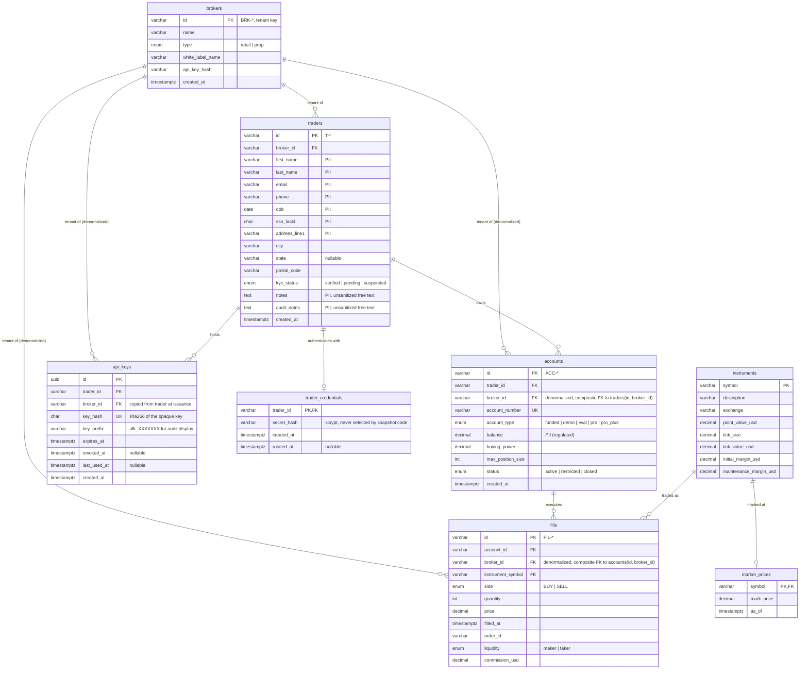

# Trader Daily Snapshot — Design

Date: 2026-09-14
Status: approved (Jose Ríos), implementation in progress
Repos: `arrowfin-mt-daily-snap-svc` (NestJS API + WebSocket), `arrowfin-mt-daily-snap-fe` (Next.js widget)

## 1. Goal

One feature: a trader opens a page and sees, for one of their accounts, the open
positions, today's realized and unrealized P&L, and a risk score, updating live as
fills arrive. Two customer types (retail and prop-firm traders) share the
infrastructure; `broker_id` is the tenant key and cross-tenant access is a P0 bug.

Non-goals: order entry, real market data, password recovery, admin tooling.

## 2. Constraints

- Dataset CSVs are production-grade data: never committed, never pushed. They live
  outside both repos and the loader reads them from `DATASET_DIR`.
- "Now" is the dataset cut `2026-08-25T14:30:00Z` unless `SNAPSHOT_NOW` overrides it.
- A CME Globex session opens 17:00 America/Chicago and closes 16:00 the next day.
  "Today" is the session that contains "now".
- Contract sizes differ per instrument (`point_value_usd`); commissions are per
  contract per side; one order can fill in pieces; positions carry across sessions.
- Stack: NestJS 12 (ESM), Prisma 7 + PostgreSQL 18, Socket.IO, Next.js 16 (App
  Router), TypeScript, Tailwind 4, TanStack Query 5.

## 3. Data model

Natural ids from the dataset are kept as primary keys (`T-001`, `ACC-1001`,
`FIL-500001`); only `api_keys` uses a UUID. Money is `DECIMAL(18,2)`, prices and
ticks `DECIMAL(18,6)` (6E ticks in 0.00005), quantities `INT`, timestamps
`TIMESTAMPTZ`.



### 3.1 Why `broker_id` is denormalized onto `accounts` and `fills`

The dataset carries the tenant only on `traders`. If tenant scoping required a
three-table join, every query that forgets the join silently returns cross-tenant
rows. With `broker_id` on the row itself:

- every tenant-bearing table can be filtered with a single `WHERE broker_id = $1`;
- composite foreign keys `accounts(trader_id, broker_id) → traders(id, broker_id)`
  and `fills(account_id, broker_id) → accounts(id, broker_id)` make it impossible
  to insert a row whose `broker_id` disagrees with its parent's;
- Postgres row-level security can be attached later without a join in the policy.

### 3.2 The index worth explaining

`fills(broker_id, account_id, filled_at)`.

The snapshot replays every fill of one account in time order (positions carry across
sessions) and then narrows to today's session for realized P&L. A composite index
leading with the tenant key means the tenant-scoped query descends straight into
that tenant's slice of the index and range-scans by account and time. It never
touches another tenant's pages, which is both a performance and an isolation
property. The same index serves the live path (append a fill, re-read one account).

Other indexes: `api_keys(key_hash)` unique for the per-request auth lookup;
`accounts(broker_id, trader_id)` for "list my accounts"; unique `(id, broker_id)`
on `traders` and `accounts` as composite-FK targets; `fills(order_id)` to group
partial fills.

### 3.3 Row-level security (timeboxed add-on)

If time allows after the app-layer isolation ships: `ENABLE` and `FORCE ROW LEVEL
SECURITY` on `traders`, `accounts`, `fills`, `api_keys` with a policy
`USING (broker_id = current_setting('app.broker_id', true))`. The repository layer
runs each request inside a transaction that first executes
`SET LOCAL app.broker_id = $1`. A query that forgets the `WHERE` then returns
nothing instead of everything.

## 4. Authentication and tenant isolation

### 4.1 Issuing an API key

`POST /auth/api/key` with `{ "traderId": "T-005", "secret": "…" }`.

1. Load `trader_credentials` + `traders.kyc_status` + `traders.broker_id` by trader id.
2. Verify the secret against the scrypt hash (Node `crypto.scrypt`, per-user salt,
   `timingSafeEqual`). If the trader does not exist, compare against a dummy hash
   so the response time does not reveal existence.
3. Refuse `kyc_status = suspended` with 403 after a successful verification.
4. Generate 32 random bytes → base64url, prefix `afk_`. Store only `sha256(key)`,
   plus `trader_id`, `broker_id` (resolved server-side from the trader row), and
   `expires_at = now + API_KEY_TTL_HOURS` (default 12).
5. Return `{ apiKey, expiresAt, principal: { traderId, brokerId }, portalName }`
   once. The plaintext key is never stored or logged.

`DELETE /auth/api/key` revokes the key that authenticated the call.

Login identifier is the trader id, not the email, so the authentication payload
carries no PII. Opaque keys were chosen over JWT because revocation is immediate,
there is no signing key to manage, and the cost is one indexed lookup per request.

### 4.2 Authenticating requests

`Authorization: Bearer afk_…` on every REST call. `ApiKeyGuard` hashes the
presented key, loads the `api_keys` row where `revoked_at IS NULL AND expires_at >
now()`, and attaches `Principal { traderId, brokerId, apiKeyId }` to the request.
Nothing in the request body, query, or path can change the principal.

WebSocket: the Socket.IO handshake carries `auth: { apiKey }`. A server-side
middleware verifies it once at connection time and joins the socket to
`broker:<brokerId>:account:<accountId>` for each account owned by the principal.
There is no client-to-server "subscribe" message at all, so there is nothing a
client can send to reach another tenant's room.

### 4.3 Where isolation is enforced

1. Guard: the principal comes only from the API key row.
2. Application: every repository port method takes `TenantContext { brokerId,
   traderId }` as its first argument. There is no way to call the data layer
   without naming the tenant.
3. Repositories: every Prisma query includes `brokerId` from the context in its
   `where`. Account lookups also include `traderId`.
4. Schema: composite FKs prevent rows that disagree with their parent's tenant.
5. Tests: a use-case test proves that an account id belonging to another tenant
   returns 404 (not 403 — no existence leak), and a controller test proves that a
   missing or invalid key returns 401.
6. RLS (if built): the database refuses rows outside `app.broker_id`.

## 5. Backend structure (NestJS 12, ESM)

```
src/
  main.ts, app.module.ts
  application/                   use cases + ports + DTOs
    auth/  issue-api-key.usecase.ts, revoke-api-key.usecase.ts, authenticate-api-key.usecase.ts
    snapshot/ get-account-snapshot.usecase.ts, list-accounts.usecase.ts
    ports/ accounts.repository.ts, fills.repository.ts, market-prices.repository.ts,
           credentials.repository.ts, api-keys.repository.ts, clock.ts
    dto/   snapshot.dto.ts, auth.dto.ts
    tenant-context.ts, principal.ts
  services/                      business rules, pure and injectable, no Prisma
    position-ledger.service.ts   average-cost ledger: open / add / reduce / flip, realized on close
    pnl.service.ts               realized (today, net of commissions) + unrealized from marks
    risk.service.ts              min(100, |notional| / balance × 100); balance 0 → 100 if exposed
    session-clock.service.ts     Globex session bounds for a given instant (America/Chicago 17:00)
    secret-hasher.service.ts     scrypt hash + verify
    api-key.service.ts           generate, hash, prefix
  controllers/                   delivery
    auth.controller.ts, accounts.controller.ts, health.controller.ts
    snapshot.gateway.ts          Socket.IO gateway (handshake auth, rooms, fill events)
    guards/api-key.guard.ts, decorators/principal.decorator.ts
    dev/dev-fills.controller.ts + dev-fills.module.ts (conditionally registered)
  infrastructure/
    config/ env.ts               validated env (DATABASE_URL, PORT, CORS_ORIGIN, SNAPSHOT_NOW,
                                 DEV_FILLS_ENABLED, DEV_TRADER_SECRET, API_KEY_TTL_HOURS)
    prisma/ prisma.service.ts, generated/, repositories implementing the ports
    seed/ load-dataset.ts        reads DATASET_DIR, upserts, creates credentials
prisma/ schema.prisma, migrations/
prisma.config.ts
```

The dev fills module is only added to `AppModule.imports` when
`DEV_FILLS_ENABLED === 'true' && NODE_ENV !== 'production'`; in production the route
does not exist rather than being guarded.

### 5.1 Snapshot algorithm

Input: `TenantContext`, `accountId`, `now`.

1. Load the account by `(id, brokerId, traderId)` → 404 if absent.
2. Load all fills for `(brokerId, accountId)` with `filled_at <= now` ordered by
   `filled_at, id`.
3. Compute `session = { open, close }` for `now`.
4. Replay fills through the average-cost ledger per instrument:
   - same direction: weighted average price, quantity grows;
   - opposite direction up to the open quantity: realized += (price − avg) × qty ×
     pointValue × direction, avg unchanged;
   - beyond flat: close everything, open the remainder at the fill price.
   Realized and commissions are accumulated only for fills inside `session`.
5. Unrealized per open position: (mark − avg) × netQty × pointValue (sign by side).
6. Notional = Σ netQty × mark × pointValue; risk = balance > 0 ? min(100,
   |notional| / balance × 100) : (notional ≠ 0 ? 100 : 0); level HIGH > 75,
   ELEVATED > 50, else LOW.

Positions with `netQty = 0` are omitted. All arithmetic is done in the service
layer on numbers (documented limitation: production would use decimal arithmetic).

### 5.2 REST contract

| Method | Path | Auth | Response |
| --- | --- | --- | --- |
| GET | `/health` | none | `{ status: "ok" }` |
| POST | `/auth/api/key` | none | 201 `{ apiKey, expiresAt, principal: { traderId, brokerId }, portalName }`; 401 invalid; 403 suspended |
| DELETE | `/auth/api/key` | Bearer | 204 |
| GET | `/me/accounts` | Bearer | `{ accounts: [{ id, accountNumber, accountType, status }] }` |
| GET | `/accounts/:accountId/snapshot` | Bearer | 200 `SnapshotDto`; 404 if not owned by the principal |
| POST | `/dev/fills` | none, dev only | 201 `{ fill }` and a `fill` WS event |

`SnapshotDto`:

```json
{
  "asOf": "2026-08-25T14:30:00.000Z",
  "session": { "open": "2026-08-24T22:00:00.000Z", "close": "2026-08-25T21:00:00.000Z" },
  "account": { "id": "ACC-1006", "accountNumber": "SMT-200001", "accountType": "pro_plus", "status": "active", "balance": 150000 },
  "positions": [
    { "symbol": "MES", "description": "Micro E-mini S&P 500", "side": "LONG", "netQty": 5,
      "avgPrice": 5640.1, "markPrice": 5642.25, "pointValue": 5, "notional": 141056.25, "unrealizedPnl": 53.75 }
  ],
  "pnl": { "realizedToday": -12.5, "commissionsToday": 8.4, "unrealized": 53.75, "dayTotal": 41.25 },
  "risk": { "score": 94.04, "level": "HIGH", "notional": 141056.25, "balance": 150000 },
  "fillsToday": 12,
  "lastFillId": "FIL-500686"
}
```

`POST /dev/fills` body follows `dataset/simulate-fills.md` (snake_case):
`{ account_id, instrument_symbol, side, quantity, price, commission_usd }`. The
fill's `broker_id` is derived from the account row, never from the request.

### 5.3 WebSocket contract

- Transport: Socket.IO, default namespace, `auth: { apiKey }` in the handshake.
- Rejected handshakes receive `unauthorized` and never connect.
- Server → client `fill`: `{ id, accountId, symbol, side, quantity, price, filledAt }`.
  No names, balances, or notes ever travel over the socket.
- Client → server: nothing.

## 6. Frontend structure (Next.js 16 App Router)

```
app/
  layout.tsx                  dark theme, QueryClientProvider
  page.tsx                    redirects to /login or /snapshot
  login/page.tsx              traderId + secret → POST /auth/api/key
  snapshot/page.tsx           account selector + <SnapshotWidget />
components/snapshot/
  SnapshotWidget.tsx, PositionsTable.tsx, PnlCards.tsx, RiskGauge.tsx,
  ConnectionBadge.tsx, states (Skeleton, ErrorState, EmptyState)
lib/api.ts (fetch with Bearer), lib/auth.ts (sessionStorage key store),
lib/socket.ts (socket.io-client factory), lib/format.ts
hooks/useSnapshot.ts (TanStack Query), hooks/useAccounts.ts, hooks/useFillStream.ts
```

- The API key lives in `sessionStorage` (tab-scoped, cleared on close). It is sent
  as `Authorization: Bearer` and in the socket handshake. The XSS trade-off is
  documented in SECURITY.md.
- `useFillStream` connects once per key, invalidates the snapshot query on every
  `fill` for the selected account, sets the badge to `reconnecting`/`stale` on
  disconnect, and refetches on reconnect.
- Risk above 75: red pulsing banner across the widget, red border on the gauge,
  `aria-live="assertive"` announcement.
- Loading (skeleton), error (retry button), empty (no positions today) states.

## 7. Testing

- `services/position-ledger.service.spec.ts`: open, add, reduce, flip; realized net
  of commissions; multi-fill order.
- `services/risk.service.spec.ts`: formula, cap at 100, zero balance.
- `services/session-clock.service.spec.ts`: session bounds around 22:00Z and DST.
- `application/snapshot/get-account-snapshot.usecase.spec.ts`: in-memory repos;
  cross-tenant account id → 404; empty account → empty positions and zero risk.
- `controllers/accounts.controller.spec.ts`: 401 without key.

## 8. Documentation deliverables

Both repos: `README.md` (Background, time and LLM disclosure, run instructions,
architecture, API, reconnect behaviour, code review, reflection) and
`SECURITY.md` (auth model, tenant isolation, PII handling, one vulnerability not
introduced, production gap). The svc SECURITY.md is canonical; the fe one covers
client-side concerns and links to it.

## 9. Deployment (stretch)

Railway: `arrowfin-mt-daily-snap-svc` service + Postgres plugin, `railway.json`
with a health check on `/health`, seed run once via `railway run`. Netlify:
`arrowfin-mt-daily-snap-fe` with the Next.js runtime, `NEXT_PUBLIC_API_URL` and
`NEXT_PUBLIC_WS_URL` pointing at Railway. Only attempted after Tasks 1–5 are done.

## 10. Cut list (in order, if the clock runs out)

1. Row-level security.
2. `DELETE /auth/api/key`.
3. Deployment.
4. DST-aware session clock (fixed −5h offset with a comment).
